# Kredi Hesaplama ve Başvuru Sistemi — API
### Loan Calculation and Application System — API

[🇹🇷 Türkçe](#-türkçe) | [🇬🇧 English](#-english)

---

# 🇹🇷 Türkçe

## Proje Hakkında

Farklı bankalara ait kredi ürünlerini arama, karşılaştırma, ödeme planı hesaplama ve kredi başvurusu oluşturma süreçlerini tek bir uygulamada birleştiren web tabanlı sistemin **backend (REST API)** tarafıdır.

Bu proje, **Türkiye Vakıflar Bankası T.A.O. (VakıfBank)** bünyesinde Düzce Üniversitesi Bilgisayar Mühendisliği lisans eğitimim kapsamında gerçekleştirdiğim zorunlu staj (10.08.2026 – 11.09.2026) sırasında geliştirilmiştir.

> Angular istemcisi bu repoda yer almamaktadır; bu repo yalnızca API katmanını içerir.

Projede kullanıcıların uygun kredi ürünlerine kolayca ulaşabilmesi, ödeme planlarını inceleyebilmesi ve doğrulanmış müşteri olarak başvuru yapabilmesi hedeflenmiştir. Sunucu tarafı **Onion Architecture** ile katmanlı olarak tasarlanmış; kimlik doğrulama, anlık bildirim, asenkron e-posta, doğrulama ve loglama süreçleri uygulamaya eklenmiştir.

## Özellikler

- **Kredi arama ve karşılaştırma:** Kredi türü, tutar, vade ve (isteğe bağlı) bankaya göre uygun ürünleri listeleme; faiz oranı, aylık taksit ve toplam ödeme bilgisi.
- **Ayrıntılı ödeme planı:** Her taksit için anapara, faiz, **KKDF**, **BSMV** ve kalan anapara hesabı.
- **Müşteri olma başvurusu:** Kişisel bilgiler ve müşteri tipini (Öğrenci / Esnaf / Emekli) doğrulayan belge yükleme (PDF, JPG, JPEG, PNG — en fazla 5 MB).
- **Kredi başvurusu:** Başvuru öncesi uygunluk kontrolü (müşteri tipi eşleşmesi, bekleyen başvuru, son 1 ay içinde reddedilmiş başvuru).
- **Yönetici işlemleri:** Müşteri olma ve kredi başvurularını inceleme, onaylama veya açıklamalı reddetme.
- **Anlık bildirim:** Karar, **SignalR** ile yalnızca ilgili müşteriye gerçek zamanlı iletilir.
- **Asenkron e-posta:** Karar e-postası **RabbitMQ** kuyruğu üzerinden arka planda gönderilir; onaylanan başvurularda ödeme planı **PDF** olarak (QuestPDF) e-postaya eklenir.
- **Güvenlik:** ASP.NET Core Identity + JWT + rol bazlı yetkilendirme.
- **Gözlemlenebilirlik:** Serilog ile istek ve iş akışı loglama, merkezi hata yönetimi middleware'i.

## Kullanıcı Rolleri

| Rol | Yapabildikleri |
|---|---|
| **Ziyaretçi** | Giriş yapmadan kredi arama, bankaya göre filtreleme, ödeme planı görüntüleme, müşteri olma başvurusu |
| **Customer (Müşteri)** | Giriş, uygunluk kontrolü, kredi başvurusu oluşturma, başvurularını takip etme, anlık/e-posta bildirim alma |
| **Admin** | Müşteri olma ve kredi başvurularını inceleme, onaylama / reddetme |

<details>
<summary>Kullanım senaryosu diyagramları</summary>

**Ziyaretçi**

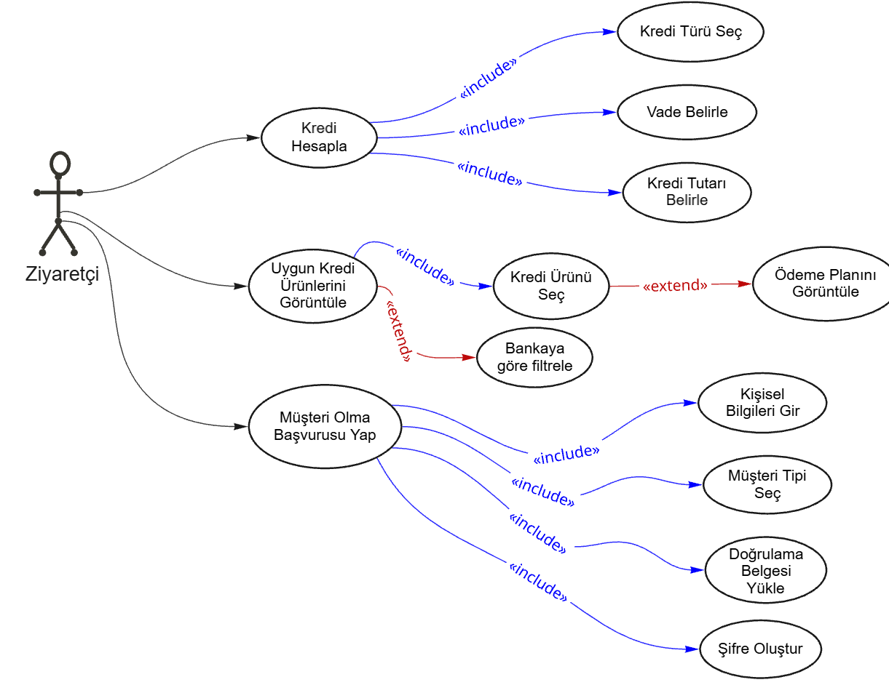

**Müşteri**

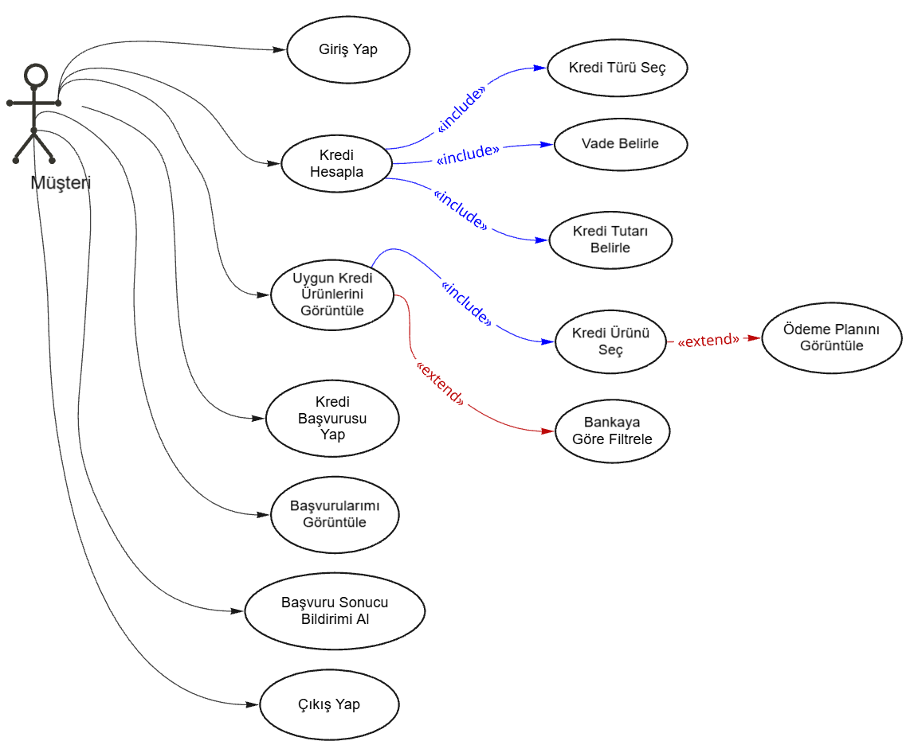

**Admin**

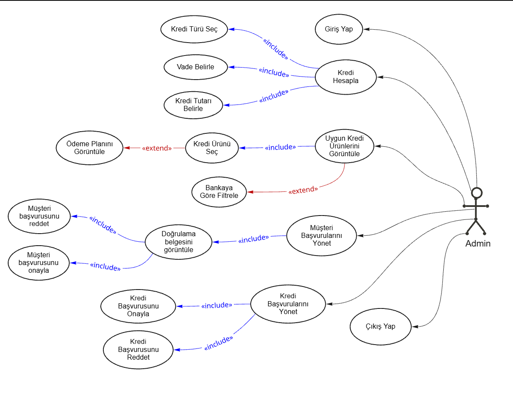

</details>

## Teknolojiler

| Alan | Teknoloji |
|---|---|
| Platform / Dil | .NET 8, C# |
| API | ASP.NET Core Web API, Swagger |
| Veritabanı | SQL Server, Entity Framework Core (Code First, Fluent API) |
| Kimlik Doğrulama | ASP.NET Core Identity, JWT (30 dk geçerli) |
| Gerçek Zamanlı İletişim | SignalR |
| Mesaj Kuyruğu | RabbitMQ |
| PDF Üretimi | QuestPDF |
| Doğrulama | FluentValidation |
| Loglama | Serilog |
| Test | Swagger, Postman |

## Mimari

Sunucu tarafı, sorumlulukların ayrılması ve sürdürülebilirlik için **Onion Architecture** yaklaşımıyla `Core`, `Infrastructure` ve `Presentation` olmak üzere üç ana klasöre ayrılmıştır.

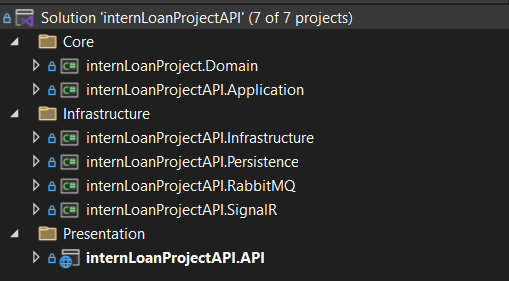

| Katman | İçerik |
|---|---|
| **Core / Domain** | Entity ve enum sınıfları |
| **Core / Application** | Servis ve repository arayüzleri, DTO'lar, mesaj modelleri, doğrulama kuralları |
| **Infrastructure / Persistence** | `DbContext`, entity yapılandırmaları, Repository, Unit of Work, servislerin somut sınıfları |
| **Infrastructure / SignalR** | Anlık bildirim (`NotificationHub`) |
| **Infrastructure / RabbitMQ** | Asenkron e-posta işleme (`EmailNotificationConsumer`) |
| **Presentation / Web API** | Controller'lar, middleware'ler; istekleri servislere yönlendirir, JSON döner |

**İstek akışı:** İstemci → Web API → Servis → Persistence (veritabanı) → yanıt.

## Veritabanı Tasarımı

Veritabanı SQL Server üzerinde **EF Core Code First** yaklaşımıyla oluşturulmuştur. Tablo ilişkileri, indeksler ve silme davranışları Fluent API ile yapılandırılmış; parasal alanlar `decimal(18,2)` olarak tanımlanmıştır. Bankalar, kredi türleri ve örnek kredi ürünleri **seed data** ile, `Admin` ve `Customer` rolleri `IdentitySeeder` ile oluşturulur.

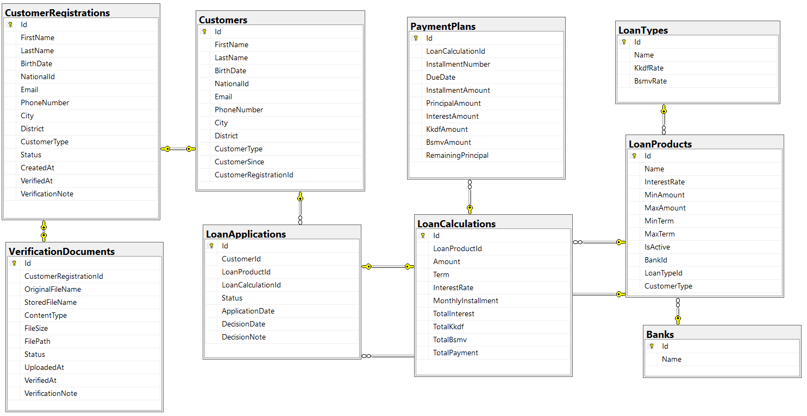

| Tablo | Açıklama |
|---|---|
| `Banks` | Bankalar |
| `LoanTypes` | Kredi türleri, KKDF ve BSMV oranları |
| `LoanProducts` | Ürün adı, faiz oranı, tutar/vade sınırları, aktiflik, banka, kredi türü, müşteri türü |
| `CustomerRegistrations` | Müşteri olma başvuruları |
| `CustomerVerificationDocuments` | Başvuruda yüklenen doğrulama belgeleri |
| `Customers` | Onaylanan müşteriler (`AppUsers.CustomerId` ile hesaba bağlı) |
| `LoanCalculations` | Hesaplama sonuçları (tutar, vade, faiz, aylık taksit, toplam ödeme) |
| `PaymentPlans` | Taksit satırları (tarih, anapara, faiz, KKDF, BSMV, kalan anapara) |
| `LoanApplications` | Müşteri + ürün + hesaplama + başvuru durumu |
| Identity tabloları | Kullanıcı, rol, claim, token vb. |

## Uygulanan Yaklaşımlar

**Generic Repository + Unit of Work**
`IReadRepository<T>` (listeleme, koşullu sorgu, tekil kayıt, Id ile bulma) ve `IWriteRepository<T>` (ekleme, güncelleme, silme) arayüzleriyle her entity için ayrı repository yazma ihtiyacı ortadan kaldırılmıştır. `IUnitOfWork` aynı `DbContext` üzerinden çalışıp değişiklikleri tek noktadan kaydeder.

**Kimlik doğrulama ve yetkilendirme**
- Giriş: `/api/Auth/login` — e-posta ve parola Identity ile doğrulanır.
- Başarılı girişte rol, kullanıcı kimliği ve e-posta bilgisini içeren, **30 dakika geçerli JWT** üretilir. Müşteriler için ek olarak `CustomerId`, `FirstName`, `LastName` claim'leri eklenir.
- Müşteri olma başvurusu onaylanmamış veya reddedilmiş kullanıcıların girişine izin verilmez; kullanıcıya durumu açıklayan mesaj döner.

**Kredi hesaplama**
- Aylık faiz, KKDF ve BSMV birlikte düşünülerek **efektif aylık oran** hesaplanır; eşit taksitli kredi formülü kullanılır (oran 0 ise tutar vadeye bölünür).
- Hesaplamadan önce ürünün aktifliği, tutar ve vade sınırları **sunucuda yeniden doğrulanır** (istemciden gelen değerlere güvenilmez).
- Her taksitte faiz kalan anapara üzerinden, KKDF ve BSMV faiz üzerinden hesaplanır; son taksitte yuvarlama farkı giderilerek kalan anapara sıfırlanır.

**Müşteri olma süreci**
Kayıt öncesi aynı T.C. kimlik numarası / e-posta kontrolü yapılır. Başvuru kaydı, belge saklama ve Identity kullanıcı oluşturma **tek transaction** içinde yürütülür; hata olursa işlem geri alınır ve kaydedilen dosya silinir.

**Kredi başvurusu uygunluk kontrolü** (`/api/LoanApplications/check-eligibility/{loanProductId}`)
1. Ürünün müşteri tipi, müşterinin tipiyle eşleşmeli
2. Bekleyen başka başvuru bulunmamalı
3. Son 1 ay içinde reddedilmiş başvuru bulunmamalı (varsa yeniden başvuru tarihi bildirilir)

**Bildirim süreci (SignalR + RabbitMQ)**
- **SignalR:** `NotificationHub`, JWT'deki `CustomerId` claim'ine göre bağlantıyı `customer-{CustomerId}` grubuna ekler; `ApplicationStatusChanged` olayı yalnızca ilgili müşteriye gönderilir.
- **RabbitMQ:** Admin kararından sonra yalnızca `ApplicationId` içeren mesaj `email-notification-queue` kuyruğuna bırakılır; `EmailNotificationConsumer` başvuruyu veritabanından yükleyip e-postayı hazırlar. Başarıda **ACK**, hatada yeniden kuyruğa alınmayan **NACK** gönderilir. Böylece e-posta ve PDF üretimi ana HTTP isteğini bekletmez.

**Doğrulama, hata yönetimi ve loglama**
- İstemci tarafı kontrollerinin aşılma ihtimaline karşı kayıt verileri API'de **FluentValidation** ile yeniden doğrulanır; iş kuralları servis katmanında korunur.
- Merkezi **hata yönetimi middleware'i** hataları yakalayıp uygun HTTP durum kodu ve açıklayıcı mesajla döner.
- `RequestLoggingMiddleware` (Serilog); zaman, HTTP yöntemi, adres, durum kodu ve süreyi hem konsola hem günlük log dosyasına yazar. Başvuru onayı ve e-posta gönderimi gibi iş olayları da loglanır.

## API Uç Noktaları

Tüm uç noktalar Swagger üzerinden incelenebilir.

| Controller | Uç nokta | Açıklama |
|---|---|---|
| Auth | `POST /api/Auth/register` | Müşteri olma başvurusu (FormData + belge) |
| Auth | `POST /api/Auth/login` | Giriş, JWT döner |
| Banks | `GET /api/Banks` | Bankaları listeler |
| LoanTypes | `GET /api/LoanTypes` | Kredi türlerini listeler |
| LoanProducts | `GET /api/LoanProducts` | Kredi ürünlerini listeler |
| LoanProducts | `POST /api/LoanProducts/Search` | Kriterlere uygun ürünleri arar |
| LoanCalculations | `POST /api/LoanCalculations/calculate` | Hesaplama ve ödeme planı oluşturur |
| LoanApplications | `GET /api/LoanApplications/check-eligibility/{id}` | Başvuru uygunluk kontrolü |
| LoanApplications | `POST /api/LoanApplications` | Kredi başvurusu oluşturur |
| LoanApplications | `GET /api/LoanApplications/my-applications` | Müşterinin başvurularını listeler |
| AdminCustomerVerification | `GET/PUT /api/AdminCustomerVerification/...` | Müşteri başvurularını listele, belge görüntüle, onayla/reddet |
| AdminLoanApplication | `GET/PUT /api/admin/loan-applications/...` | Kredi başvurularını listele, onayla/reddet |
| SignalR | `/notificationHub` | Anlık bildirim bağlantısı |

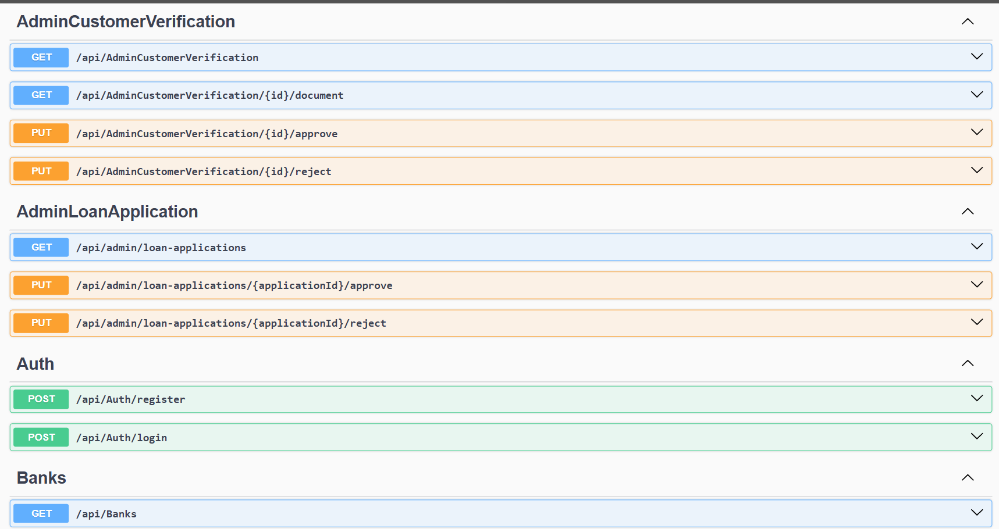

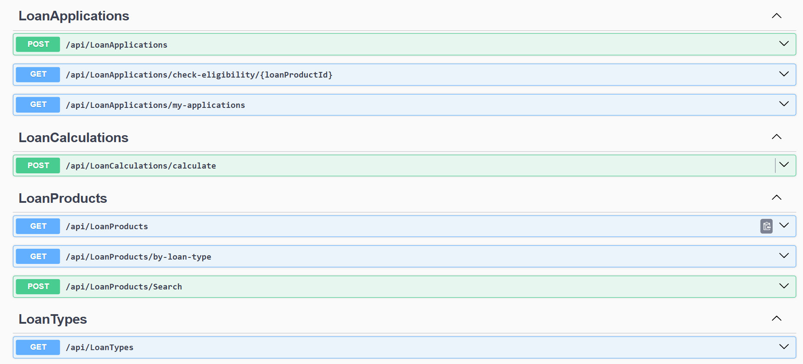

## Proje Yapısı

```
loan-calcuation-application-api/
│
├── Core/
│   ├── Domain/                  # Entity ve enum sınıfları
│   └── Application/             # Arayüzler, DTO'lar, doğrulama kuralları
│
├── Infrastructure/
│   ├── Persistence/             # DbContext, Repository, Unit of Work, servisler
│   ├── SignalR/                 # NotificationHub
│   └── RabbitMQ/                # EmailNotificationConsumer
│
├── Presentation/
│   └── internLoanProjectAPI.API/   # Web API, controller'lar, middleware'ler
│
├── internLoanProjectAPI.sln
├── .gitattributes
├── .gitignore
└── README.md
```

> Klasör adları örnek amaçlıdır; alt proje adlarını reponun gerçek yapısına göre kontrol edin.

## Kurulum

### Gereksinimler

- [.NET 8 SDK](https://dotnet.microsoft.com/download/dotnet/8.0)
- SQL Server (LocalDB veya tam sürüm)
- [RabbitMQ](https://www.rabbitmq.com/download.html) (varsayılan: `localhost:5672`)
- E-posta gönderimi için bir SMTP hesabı

### Adımlar

Projeyi klonlayıp proje dizinine geçin:

```bash
git clone https://github.com/siladrtl/loan-calcuation-application-api.git
cd loan-calcuation-application-api
```

Bağlantı dizesi, JWT ve SMTP ayarlarını güncelleyin (aşağıdaki **Yapılandırma** bölümüne bakın). Ardından migration'ları uygulayın (seed data otomatik eklenir):

```bash
dotnet ef database update --project Infrastructure/<Persistence-projesi> --startup-project Presentation/internLoanProjectAPI.API
```

RabbitMQ'yu başlatın ve API'yi çalıştırın:

```bash
dotnet run --project Presentation/internLoanProjectAPI.API
```

Uygulama çalıştığında Swagger arayüzü `https://localhost:<port>/swagger` adresinden kullanılabilir.

### Yapılandırma (`appsettings.json`)

Gizli bilgileri repoya eklemeyin; yerel geliştirmede **User Secrets** veya ortam değişkenleri kullanın.

```jsonc
{
  "ConnectionStrings": { "DefaultConnection": "<SQL Server bağlantı dizesi>" },
  "Jwt": { "Key": "<en az 32 karakterlik gizli anahtar>", "Issuer": "...", "Audience": "..." },
  "Email": { "Host": "...", "Port": 587, "User": "...", "Password": "..." }
}
```

> Anahtar adları projedeki gerçek `appsettings.json` ile aynı olmalıdır.

## Ekran Görüntüleri

**Anlık bildirim (SignalR)** — Admin kararı, sayfa yenilemeden müşteriye iletilir.

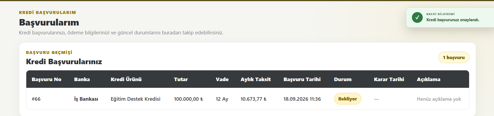

**Onay e-postası (RabbitMQ)** — Arka planda asenkron gönderilir.

<p>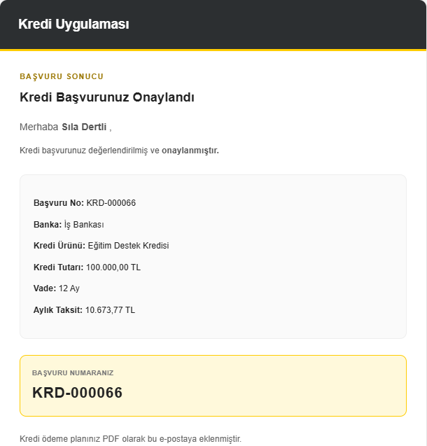</p>

**QuestPDF ile üretilen ödeme planı** — Onay e-postasına eklenir.

<p>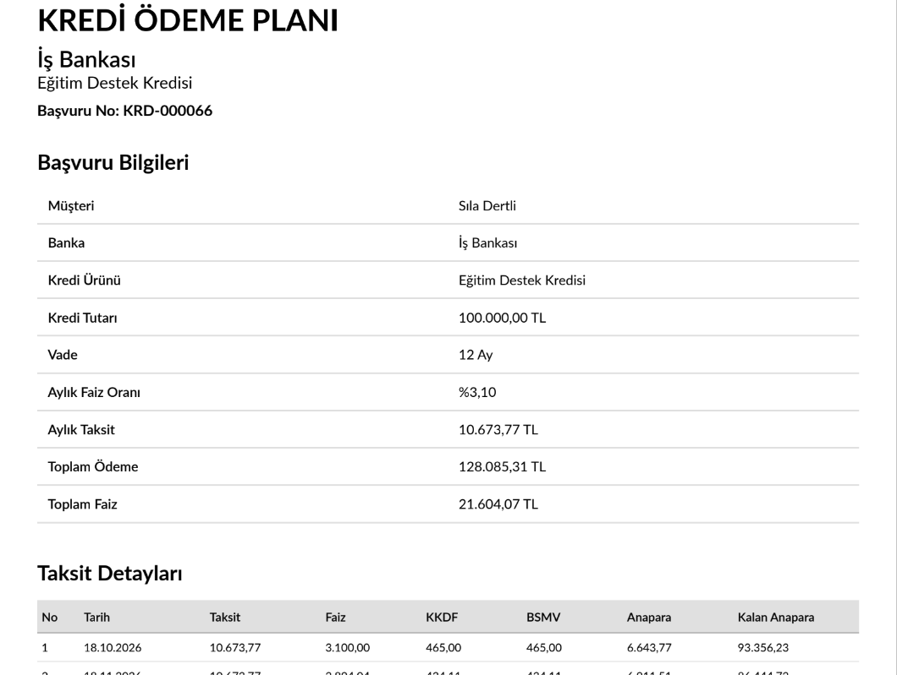</p>

**Serilog istek logları**

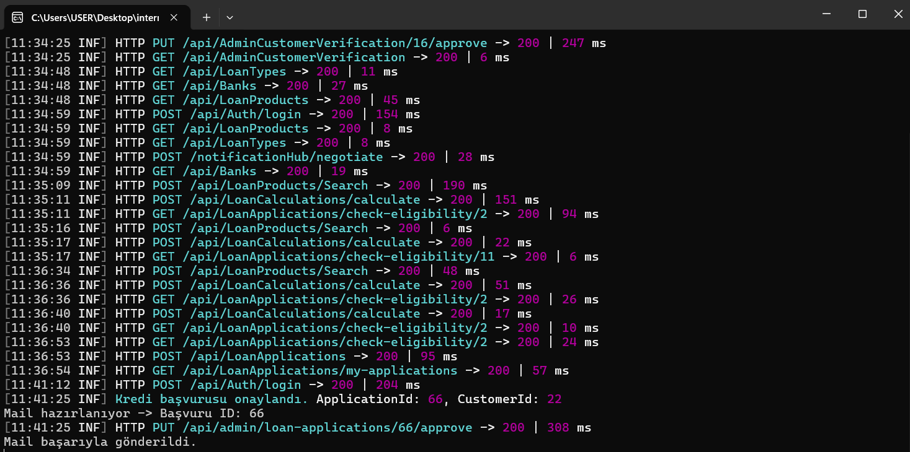

## Edinilen Kazanımlar

Onion Architecture, Generic Repository ve Unit of Work ile katmanlı mimari; transaction ile veri bütünlüğü; Identity, JWT ve rol bazlı yetkilendirme; SignalR ile gerçek zamanlı iletişim; RabbitMQ ile asenkron işlem yönetimi; FluentValidation, merkezi hata yönetimi ve Serilog ile güvenilir, izlenebilir bir API geliştirme.

## Uyarı

Bu proje staj kapsamında eğitim ve öğrenme amacıyla geliştirilmiştir. Banka, kredi ürünü ve faiz bilgileri örnek (seed) verilerdir; gerçek bir bankacılık sistemini veya gerçek kredi tekliflerini temsil etmez. Uygulama tarafından üretilen sonuçlar finansal tavsiye olarak değerlendirilmemelidir.

## Geliştirici

**Sıla Dertli** 

---

# 🇬🇧 English

## About the Project

This is the **backend (REST API)** of a web-based system that brings loan product search, comparison, repayment plan calculation and loan application into a single application.

The project was developed during my mandatory internship (10.08.2026 – 11.09.2026) at **Türkiye Vakıflar Bankası T.A.O. (VakıfBank)** as part of my undergraduate studies in Computer Engineering at Düzce University.

> The Angular client is not part of this repository; this repository contains only the API layer.

The goal is to let users easily find suitable loan products, review repayment plans and apply as verified customers. The server side follows **Onion Architecture**, and includes authentication, real-time notifications, asynchronous e-mail, validation and logging.

## Features

- **Loan search and comparison:** Find suitable products by loan type, amount, term and (optionally) bank, with interest rate, monthly installment and total payment.
- **Detailed repayment plan:** Principal, interest, **KKDF**, **BSMV** and remaining principal for every installment.
- **Customer registration:** Personal details plus a verification document for the customer type (Student / Tradesman / Retiree) — PDF, JPG, JPEG or PNG, max 5 MB.
- **Loan application:** Eligibility check before applying (customer type match, no pending application, no rejection within the last month).
- **Admin operations:** Review, approve or reject (with an explanation) customer registrations and loan applications.
- **Real-time notification:** The decision is pushed through **SignalR** only to the relevant customer.
- **Asynchronous e-mail:** The result e-mail is sent in the background via a **RabbitMQ** queue; for approved applications the repayment plan is attached as a **PDF** (QuestPDF).
- **Security:** ASP.NET Core Identity + JWT + role-based authorization.
- **Observability:** Request and workflow logging with Serilog, centralized error-handling middleware.

## User Roles

| Role | Capabilities |
|---|---|
| **Visitor** | Search loans without logging in, filter by bank, view repayment plans, apply to become a customer |
| **Customer** | Log in, check eligibility, create loan applications, track them, receive real-time and e-mail notifications |
| **Admin** | Review and approve / reject customer registrations and loan applications |

<details>
<summary>Use case diagrams</summary>

**Visitor**


**Customer**


**Admin**


</details>

## Technologies

| Area | Technology |
|---|---|
| Platform / Language | .NET 8, C# |
| API | ASP.NET Core Web API, Swagger |
| Database | SQL Server, Entity Framework Core (Code First, Fluent API) |
| Authentication | ASP.NET Core Identity, JWT (30-minute lifetime) |
| Real-time Communication | SignalR |
| Message Queue | RabbitMQ |
| PDF Generation | QuestPDF |
| Validation | FluentValidation |
| Logging | Serilog |
| Testing | Swagger, Postman |

## Architecture

To separate responsibilities and keep the code maintainable, the server side follows **Onion Architecture** and is split into three main folders: `Core`, `Infrastructure` and `Presentation`.


| Layer | Contents |
|---|---|
| **Core / Domain** | Entity and enum classes |
| **Core / Application** | Service and repository interfaces, DTOs, message models, validation rules |
| **Infrastructure / Persistence** | `DbContext`, entity configurations, Repository, Unit of Work, concrete service classes |
| **Infrastructure / SignalR** | Real-time notifications (`NotificationHub`) |
| **Infrastructure / RabbitMQ** | Asynchronous e-mail processing (`EmailNotificationConsumer`) |
| **Presentation / Web API** | Controllers and middlewares; routes requests to services and returns JSON |

**Request flow:** Client → Web API → Service → Persistence (database) → response.

## Database Design

The database is created on SQL Server with the **EF Core Code First** approach. Relationships, indexes and delete behaviors are configured with Fluent API; monetary fields use `decimal(18,2)`. Banks, loan types and sample loan products are added as **seed data**, and the `Admin` and `Customer` roles are created by `IdentitySeeder`.


| Table | Description |
|---|---|
| `Banks` | Banks |
| `LoanTypes` | Loan types with KKDF and BSMV rates |
| `LoanProducts` | Product name, interest rate, amount/term limits, active flag, bank, loan type, customer type |
| `CustomerRegistrations` | Customer registration requests |
| `CustomerVerificationDocuments` | Verification documents uploaded with a request |
| `Customers` | Approved customers (linked to the account via `AppUsers.CustomerId`) |
| `LoanCalculations` | Calculation results (amount, term, rate, monthly installment, total payment) |
| `PaymentPlans` | Installment rows (date, principal, interest, KKDF, BSMV, remaining principal) |
| `LoanApplications` | Customer + product + calculation + application status |
| Identity tables | Users, roles, claims, tokens, etc. |

## Implementation Details

**Generic Repository + Unit of Work**
`IReadRepository<T>` (list, filtered query, single record, find by Id) and `IWriteRepository<T>` (add, update, delete) remove the need for a separate repository per entity. `IUnitOfWork` works on a single `DbContext` and saves changes in one place.

**Authentication and authorization**
- Login: `/api/Auth/login` — e-mail and password are verified through Identity.
- On success a **JWT valid for 30 minutes** is issued, containing the user id, e-mail and role. For customers, `CustomerId`, `FirstName` and `LastName` claims are added as well.
- Users whose customer registration is pending or rejected cannot log in; they receive a message explaining their status.

**Loan calculation**
- An **effective monthly rate** is computed from the monthly interest, KKDF and BSMV; the equal-installment loan formula is used (if the rate is 0, the amount is divided by the term).
- Before calculating, the product's active status and the amount/term limits are **re-validated on the server** — values from the client are never trusted.
- For each installment, interest is computed on the remaining principal and KKDF/BSMV on the interest; any rounding difference is corrected in the last installment so the remaining principal ends at zero.

**Customer registration**
Before registration, duplicate national ID / e-mail is checked. Saving the request, storing the document and creating the Identity user run in a **single transaction**; on failure everything is rolled back and the saved file is deleted.

**Loan application eligibility check** (`/api/LoanApplications/check-eligibility/{loanProductId}`)
1. The product's customer type must match the customer's type
2. There must be no other pending application
3. There must be no rejected application within the last month (if there is, the date when they can re-apply is returned)

**Notification flow (SignalR + RabbitMQ)**
- **SignalR:** `NotificationHub` adds the connection to the `customer-{CustomerId}` group based on the `CustomerId` claim in the JWT; the `ApplicationStatusChanged` event is sent only to the relevant customer.
- **RabbitMQ:** After the admin's decision, a message carrying only the `ApplicationId` is published to `email-notification-queue`; `EmailNotificationConsumer` loads the application from the database and prepares the e-mail. It sends **ACK** on success and **NACK** (without requeue) on failure, so e-mail and PDF generation never block the main HTTP request.

**Validation, error handling and logging**
- Registration data is validated again on the API with **FluentValidation**, in case client-side checks are bypassed; business rules are enforced in the service layer.
- A centralized **error-handling middleware** catches exceptions and returns a suitable HTTP status code and a descriptive message.
- `RequestLoggingMiddleware` (Serilog) writes the time, HTTP method, path, status code and duration to both the console and daily log files. Business events such as application approval and e-mail delivery are logged too.

## API Endpoints

All endpoints can be explored via Swagger.

| Controller | Endpoint | Description |
|---|---|---|
| Auth | `POST /api/Auth/register` | Customer registration (FormData + document) |
| Auth | `POST /api/Auth/login` | Login, returns a JWT |
| Banks | `GET /api/Banks` | Lists banks |
| LoanTypes | `GET /api/LoanTypes` | Lists loan types |
| LoanProducts | `GET /api/LoanProducts` | Lists loan products |
| LoanProducts | `POST /api/LoanProducts/Search` | Searches products matching the criteria |
| LoanCalculations | `POST /api/LoanCalculations/calculate` | Calculates and creates the repayment plan |
| LoanApplications | `GET /api/LoanApplications/check-eligibility/{id}` | Application eligibility check |
| LoanApplications | `POST /api/LoanApplications` | Creates a loan application |
| LoanApplications | `GET /api/LoanApplications/my-applications` | Lists the customer's applications |
| AdminCustomerVerification | `GET/PUT /api/AdminCustomerVerification/...` | List registrations, view documents, approve/reject |
| AdminLoanApplication | `GET/PUT /api/admin/loan-applications/...` | List loan applications, approve/reject |
| SignalR | `/notificationHub` | Real-time notification connection |


## Project Structure

```
loan-calcuation-application-api/
│
├── Core/
│   ├── Domain/                  # Entities and enums
│   └── Application/             # Interfaces, DTOs, validation rules
│
├── Infrastructure/
│   ├── Persistence/             # DbContext, Repository, Unit of Work, services
│   ├── SignalR/                 # NotificationHub
│   └── RabbitMQ/                # EmailNotificationConsumer
│
├── Presentation/
│   └── internLoanProjectAPI.API/   # Web API, controllers, middlewares
│
├── internLoanProjectAPI.sln
├── .gitattributes
├── .gitignore
└── README.md
```

> Folder names are illustrative; please verify sub-project names against the actual repository structure.

## Installation

### Prerequisites

- [.NET 8 SDK](https://dotnet.microsoft.com/download/dotnet/8.0)
- SQL Server (LocalDB or full edition)
- [RabbitMQ](https://www.rabbitmq.com/download.html) (default: `localhost:5672`)
- An SMTP account for sending e-mails

### Steps

Clone the repository and navigate to the project directory:

```bash
git clone https://github.com/siladrtl/loan-calcuation-application-api.git
cd loan-calcuation-application-api
```

Update the connection string, JWT and SMTP settings (see **Configuration** below). Then apply the migrations (seed data is added automatically):

```bash
dotnet ef database update --project Infrastructure/<Persistence-project> --startup-project Presentation/internLoanProjectAPI.API
```

Start RabbitMQ and run the API:

```bash
dotnet run --project Presentation/internLoanProjectAPI.API
```

Once running, the Swagger UI is available at `https://localhost:<port>/swagger`.

### Configuration (`appsettings.json`)

Do not commit secrets; use **User Secrets** or environment variables for local development.

```jsonc
{
  "ConnectionStrings": { "DefaultConnection": "<SQL Server connection string>" },
  "Jwt": { "Key": "<secret key of at least 32 characters>", "Issuer": "...", "Audience": "..." },
  "Email": { "Host": "...", "Port": 587, "User": "...", "Password": "..." }
}
```

> Key names must match the real `appsettings.json` of the project.

## Screenshots

**Real-time notification (SignalR)** — the admin's decision reaches the customer without a page refresh.


**Approval e-mail (RabbitMQ)** — sent asynchronously in the background.

<p></p>

**Repayment plan generated with QuestPDF** — attached to the approval e-mail.

<p></p>

**Serilog request logs**


## What I Learned

Layered architecture with Onion Architecture, Generic Repository and Unit of Work; data integrity with transactions; Identity, JWT and role-based authorization; real-time communication with SignalR; asynchronous processing with RabbitMQ; building a reliable and traceable API with FluentValidation, centralized error handling and Serilog.

## Disclaimer

This project was developed for educational purposes during an internship. The banks, loan products and interest rates are sample (seed) data and do not represent a real banking system or real loan offers. The results produced by the application must not be considered financial advice.

## Author

**Sıla Dertli** —
